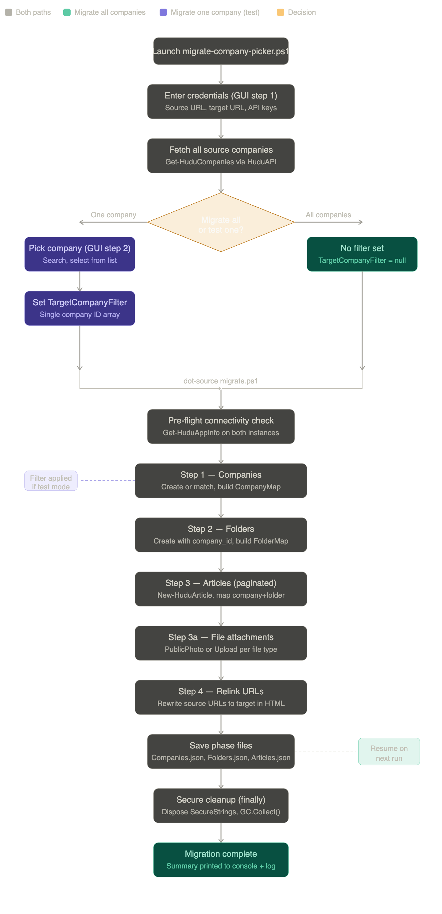

# Hudu KB Migration Script

Migrates knowledge base articles (Central KB and company-specific KB) from one Hudu instance to another using PowerShell and the [HuduAPI](https://www.powershellgallery.com/packages/HuduAPI) module.

## Overview

This script moves KB content between Hudu tenants in a controlled, testable way:

| Phase                   | What happens                                                      |
| ----------------------- | ----------------------------------------------------------------- |
| **Companies**           | Fetched from source; created or matched in target with ID mapping |
| **Folders**             | Created in target, linked to mapped company IDs                   |
| **Articles**            | Migrated with optional single-company filtering for testing       |
| **Files / attachments** | Downloaded from source, size-checked, re-uploaded to target       |
| **URL relinking**       | Internal article links rewritten to target instance URLs          |

**References used during development:**

- [ITGlue-Hudu-Migration](https://github.com/lwhitelock/ITGlue-Hudu-Migration) — attachment handling patterns
- [Confluence-Hudu-Migration](https://github.com/lwhitelock/Confluence-Hudu-Migration) — migration structure
- [HuduAPI module](https://www.powershellgallery.com/packages/HuduAPI) — REST API wrapper (v2.4.5+)

## Requirements

- **PowerShell 7+**
- **HuduAPI module** v2.4.5 or later
- API keys for **source** and **target** Hudu instances (admin-level recommended)
- Network access to both Hudu URLs

## Quick Start

```powershell
# Install the HuduAPI module (if not already present)
Install-Module HuduAPI -MinimumVersion 2.4.5 -Scope CurrentUser

# Run the migration script (dot-source so GUI and variables persist)
cd path\to\hudu-migration
. .\company-migration.ps1
```

On launch, the script will:

1. Prompt for source and target Hudu URLs and API keys (stored as `SecureString`, never written to disk)
2. Open a **company selector GUI** — choose one company for testing or migrate all companies
3. Run the migration phases with checkpoint JSON files for resume
4. Write a timestamped log under your configured log directory (default: `C:\Temp\HuduMigration\logs`)

### Optional parameters

You can pre-set variables before dot-sourcing:

```powershell
$SourceHuduUrl = "https://source.example.hudu.com"
$TargetHuduUrl = "https://target.example.hudu.com"
$SourceHuduApiKeySecure = Read-Host "Source API Key" -AsSecureString
$TargetHuduApiKeySecure = Read-Host "Target API Key" -AsSecureString
$MaxFileSizeMB = 100
$TempPath = "C:\Temp\HuduMigration\downloads"
$LogDir   = "C:\Temp\HuduMigration\logs"

. .\company-migration.ps1
```

## Features

- **Single-company testing mode** — GUI to migrate one company before full production run
- **Resume from checkpoints** — phase progress saved as JSON (`companies`, `folders`, `articles` mappings)
- **Secure API key handling** — `SecureString` only; keys disposed in `finally` block
- **File attachment migration** — downloads `public_photos` and `uploads`; skips files over size limit (default 100 MB)
- **URL relinking** — rewrites internal links from source base URL / article IDs to target URLs
- **Comprehensive logging** — timestamped log file plus per-phase JSON snapshots

## Migration Flow

```
┌─────────────────────────────────────────────────────────────────┐
│                        START MIGRATION                          │
└────────────────────────────┬────────────────────────────────────┘
                             ▼
┌─────────────────────────────────────────────────────────────────┐
│  Credentials: Source URL + API key, Target URL + API key        │
│  (SecureString; optional max file size, temp/log paths)         │
└────────────────────────────┬────────────────────────────────────┘
                             ▼
┌─────────────────────────────────────────────────────────────────┐
│  Company Selector GUI                                           │
│  • Migrate ONE company (testing)                                │
│  • Migrate ALL companies (production)                           │
└────────────────────────────┬────────────────────────────────────┘
                             ▼
┌─────────────────────────────────────────────────────────────────┐
│  STEP 1: Companies                                              │
│  Source → fetch │ Target → create/match │ CompanyMap JSON       │
└────────────────────────────┬────────────────────────────────────┘
                             ▼
┌─────────────────────────────────────────────────────────────────┐
│  STEP 2: Folders                                                │
│  Source → fetch │ Target → create │ FolderMap JSON              │
└────────────────────────────┬────────────────────────────────────┘
                             ▼
┌─────────────────────────────────────────────────────────────────┐
│  STEP 3: Articles (+ attachments)                               │
│  Paginated fetch │ Filter (single-company mode) │ Create        │
│  Download files │ Size check │ Upload │ ArticleMap JSON         │
└────────────────────────────┬────────────────────────────────────┘
                             ▼
┌─────────────────────────────────────────────────────────────────┐
│  STEP 4: URL relinking                                          │
│  Rewrite source article/base URLs → target URLs in content      │
└────────────────────────────┬────────────────────────────────────┘
                             ▼
┌─────────────────────────────────────────────────────────────────┐
│  Summary + cleanup (dispose SecureStrings)                      │
└─────────────────────────────────────────────────────────────────┘
```

## Flowchart



## Repository Layout

```
hudu-migration/
├── README.md                 # This file — overview and setup
├── company-migration.ps1     # Main migration script (company selector GUI)
├── docs/                     # (planned) testing, troubleshooting, API notes
│   ├── TESTING-GUIDE.md
│   ├── TROUBLESHOOTING.md
│   └── API-REFERENCE.md
└── logs/                     # (planned) .gitkeep for local log output
```

## Testing Checklist

Use a **small test company** (roughly 10–50 articles) before a full production migration:

- [ ] Run in **single-company mode** via the GUI
- [ ] Verify companies created or correctly matched in target
- [ ] Confirm folders appear under the right company in target
- [ ] Spot-check article titles, body content, and sharing settings
- [ ] Validate file attachments (including files near the size limit)
- [ ] Click internal links in migrated articles — they should point to target URLs
- [ ] Review log file and phase JSON checkpoints for errors or skips
- [ ] Re-run or resume if interrupted (checkpoint JSON in log directory)
- [ ] Plan and schedule full **all-companies** migration after sign-off

## Known Issues

_Add findings from test runs here._

| Issue | Notes |
| ----- | ----- |
| —     | —     |

## Code Review & Next Steps

**For reviewers (e.g. teammate code review):**

1. Review `company-migration.ps1` — logic, error handling, security (API keys, file I/O)
2. Test with one small company first
3. Document findings in this repo or your team tracker
4. Plan production migration window after successful test

**Suggested review focus:**

- Company/folder/article mapping edge cases (orphan articles, global KB)
- Attachment download auth and large-file skip behavior
- URL relink regex coverage for your article link formats
- Checkpoint resume behavior after partial failure

## References

- [HuduAPI on PowerShell Gallery](https://www.powershellgallery.com/packages/HuduAPI)
- [ITGlue-Hudu-Migration](https://github.com/lwhitelock/ITGlue-Hudu-Migration)
- [Confluence-Hudu-Migration](https://github.com/lwhitelock/Confluence-Hudu-Migration)
- [Hudu API documentation](https://www.hudu.com/api)
