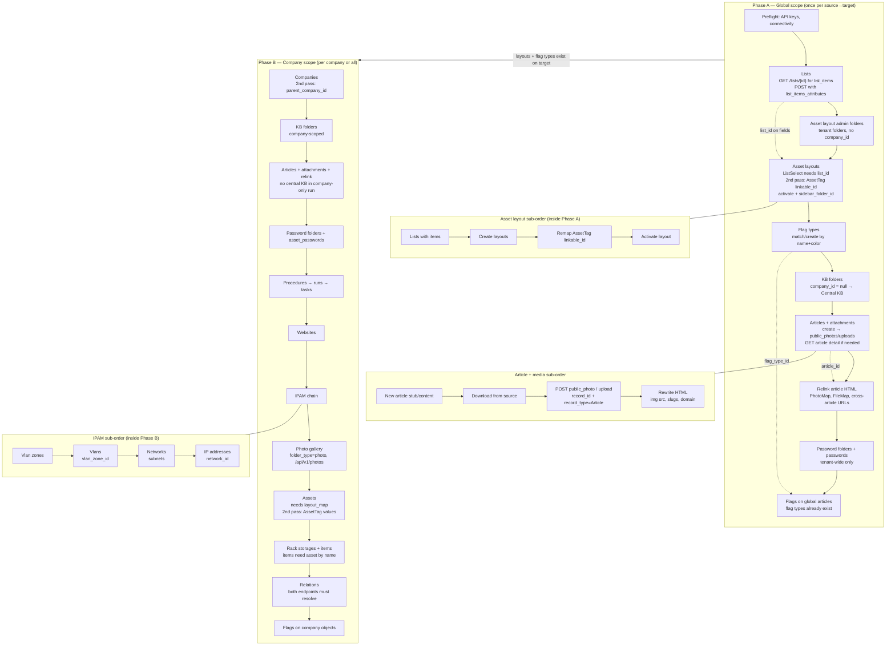

# Hudu Migration (Python)

Python port of `company-migration.ps1`. Two-instance only (source → target). No external dependencies — stdlib only.

## Prerequisites

- Python 3.11+
- A `.env` file at the repo root (see below)

## Setup

```bash
cp .env.example .env   # or create .env manually
# fill in SOURCE_API_KEY, SOURCE_BASE_URL, TARGET_API_KEY, TARGET_BASE_URL
```

## Running

Always run from the **repo root**. Migration is split into two phases — run global first, then company.

```bash
# Phase 1 — tenant-wide data (run once per source→target pair)
python3 -m python.main --scope global

# Phase 2 — per-company data (interactive: pick one company or all)
python3 -m python.main --scope company

# Skip asset layouts (global) and assets/relations (company)
python3 -m python.main --scope global --skip-assets
python3 -m python.main --scope company --skip-assets
```

## Environment variables

| Variable | Required | Default | Description |
|---|---|---|---|
| `SOURCE_API_KEY` | yes | — | API key for the source Hudu instance |
| `SOURCE_BASE_URL` | yes | — | Base URL of the source Hudu instance |
| `TARGET_API_KEY` | yes | — | API key for the target Hudu instance |
| `TARGET_BASE_URL` | yes | — | Base URL of the target Hudu instance |
| `SKIP_ASSET_MIGRATION` | no | `false` | Skip layouts (global) and assets/relations (company); overridden by `--skip-assets` |
| `MAX_FILE_SIZE_MB` | no | `100` | Max file size for attachment uploads |

## Scope behaviour

`main.py` routes steps by `--scope`. Each step receives `scope: "global" | "company"` and, for company scope, `company_ids` from the interactive picker (`None` = all companies, `[id]` = one company).

| Scope | Steps run |
|---|---|
| `global` | Lists + layouts, central KB folders/articles, tenant passwords, flags (types + global articles) |
| `company` | Companies (after picker), company KB, passwords, procedures, websites, IPAM, photos, assets, racks, relations, flags |

Company selection: when you run `--scope company`, companies are fetched from the source API and you choose a number or `0` for all.

## Migration execution order

What to create first, and what each phase depends on. Run **global** once per source→target, then **company** per client.



-- Hudu Data Model -- ER Diagram --

```mermaid
erDiagram
    COMPANY ||--o{ COMPANY : "parent_company_id"
    COMPANY ||--o{ FOLDER : "company_id optional"
    COMPANY ||--o{ ARTICLE : "company_id null = Global KB"
    COMPANY ||--o{ ASSET_PASSWORD : "company_id"
    COMPANY ||--o{ ASSET : "company_id"
    COMPANY ||--o{ PROCEDURE : "company_id"
    COMPANY ||--o{ WEBSITE : "company_id"
    COMPANY ||--o{ NETWORK : "company_id"
    COMPANY ||--o{ VLAN_ZONE : "company_id optional"
    COMPANY ||--o{ VLAN : "company_id optional"
    COMPANY ||--o{ RACK_STORAGE : "company_id"
    COMPANY ||--o{ PHOTO : "photoable Company"

    FOLDER ||--o{ FOLDER : "parent_folder_id"
    FOLDER ||--o{ ARTICLE : "folder_id"
    FOLDER ||--o{ PHOTO : "folder_id gallery"

    LIST ||--o{ ASSET_LAYOUT_FIELD : "list_id ListSelect"

    FOLDER ||--o{ ASSET_LAYOUT : "sidebar_folder_id admin only"
    ASSET_LAYOUT ||--|{ ASSET_LAYOUT_FIELD : "fields"
    ASSET_LAYOUT ||--o{ ASSET : "asset_layout_id"
    ASSET_LAYOUT ||--o{ ASSET_LAYOUT_FIELD : "linkable_id AssetTag"

    ARTICLE ||--o{ PUBLIC_PHOTO : "record Article"
    ARTICLE ||--o{ UPLOAD : "record Article"
    ARTICLE ||--o{ FLAG : "flagable Article"
    ARTICLE ||--o{ RELATION : "fromable toable"

    PASSWORD_FOLDER ||--o{ ASSET_PASSWORD : "password_folder_id"
    ASSET_PASSWORD ||--o{ FLAG : "flagable AssetPassword"
    ASSET_PASSWORD ||--o{ RELATION : "fromable toable"

    ASSET ||--o{ FLAG : "flagable Asset"
    ASSET ||--o{ RACK_STORAGE_ITEM : "asset_id"
    ASSET ||--o{ RELATION : "fromable toable"
    ASSET ||--o{ IP_ADDRESS : "asset_id optional"

    VLAN_ZONE ||--o{ VLAN : "vlan_zone_id"
    NETWORK ||--o{ IP_ADDRESS : "network_id"
    NETWORK ||--o{ RELATION : "fromable Network"

    RACK_STORAGE ||--|{ RACK_STORAGE_ITEM : "items"
    RACK_STORAGE ||--o{ RELATION : "fromable RackStorage"

    PROCEDURE ||--|{ PROCEDURE_TASK : "tasks"
    PROCEDURE_TASK ||--o{ PROCEDURE_TASK : "parent_task_id"
    PROCEDURE ||--o{ RELATION : "skipped in migration"

    WEBSITE ||--o{ RELATION : "fromable Website"
    FLAG_TYPE ||--o{ FLAG : "flag_type_id"

    COMPANY {
        int id PK
        string name
        int parent_company_id FK
        string notes
    }

    FOLDER {
        int id PK
        string name
        int company_id FK "null = global KB"
        int parent_folder_id FK
        string folder_type "kb | photo | admin layout"
    }

    LIST {
        int id PK
        string name
        json list_items "GET by id not index"
    }

    ASSET_LAYOUT {
        int id PK
        string name
        bool active
        int sidebar_folder_id FK
        bool include_passwords
    }

    ASSET_LAYOUT_FIELD {
        int id PK
        int layout_id FK
        string label
        string field_type
        int list_id FK "ListSelect"
        int linkable_id FK "AssetTag layout"
        int position
    }

    ARTICLE {
        int id PK
        string name
        text content
        int company_id FK "0/null = central KB"
        int folder_id FK
        bool enable_sharing
    }

    PUBLIC_PHOTO {
        int id PK
        string slug
        int record_id FK
        string record_type "Article"
        string url
    }

    UPLOAD {
        int id PK
        string slug
        int record_id FK
        string record_type
    }

    PASSWORD_FOLDER {
        int id PK
        string name
        string security
    }

    ASSET_PASSWORD {
        int id PK
        string name
        int company_id FK
        int password_folder_id FK
        string login_url
    }

    ASSET {
        int id PK
        string name
        int company_id FK
        int asset_layout_id FK
        json custom_fields
    }

    VLAN_ZONE {
        int id PK
        string name
        int company_id FK
    }

    VLAN {
        int id PK
        int vlan_id
        int vlan_zone_id FK
        int company_id FK
    }

    NETWORK {
        int id PK
        string name
        string address CIDR
        int company_id FK
        int location_id FK "often unmigrated"
    }

    IP_ADDRESS {
        int id PK
        string address
        int network_id FK
        int company_id FK
        int asset_id FK
    }

    RACK_STORAGE {
        int id PK
        string name
        int company_id FK
        int height
    }

    RACK_STORAGE_ITEM {
        int id PK
        int rack_storage_id FK
        int asset_id FK
        int side
        int status
    }

    PROCEDURE {
        int id PK
        string name
        int company_id FK
        bool run
    }

    PROCEDURE_TASK {
        int id PK
        int procedure_id FK
        int parent_task_id FK
        string name
        bool completed
    }

    WEBSITE {
        int id PK
        string name
        int company_id FK
        bool paused
    }

    RELATION {
        int id PK
        string fromable_type
        int fromable_id
        string toable_type
        int toable_id
    }

    FLAG_TYPE {
        int id PK
        string name
        string color
    }

    FLAG {
        int id PK
        int flag_type_id FK
        string flagable_type
        int flagable_id
        string description
    }

    PHOTO {
        int id PK
        int company_id FK
        int folder_id FK
        string photoable_type
    }
```
